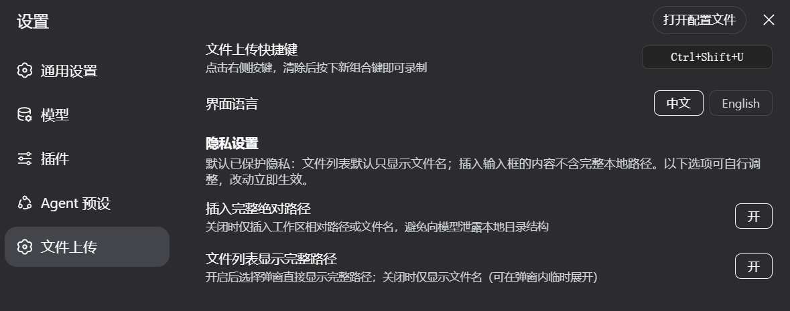

# dsh-file-upload

<p align="center">
  <a href="./README.md"></a>
  <a href="./README.zh-CN.md"></a>
</p>

为 [DeepSeek Harness](https://github.com/deepseek-ai/deepseek-harness) 提供的 Windows 文件上传插件：
通过**可自定义快捷键**唤起 **Windows 原生文件选择对话框**（基于 **PowerShell 7**，带明确标注的
Windows PowerShell 5.1 兜底），随后在图形化界面中选择**复制文件到工作区**、**以安全格式插入输入框**、
或**两者都要**。界面支持**中英双语切换**。**隐私默认受保护**——见[隐私](#隐私)。

> ⚠️ 仅支持 Windows。需要 PowerShell 7（推荐）或系统自带的 Windows PowerShell 5.1。

---

## 截图

| 设置页 —— 快捷键 / 语言 / 隐私开关 |
|---|
|  |

*出于隐私考虑只展示设置页：其他界面会显示文件名/路径，不放入公开仓库。*

---

## 功能

- **快捷键**：默认 `Ctrl+Shift+U`——在设置中可录制任意组合键（点击按键 → 按下新组合 → 生效，Esc 取消）。
- **可靠且简单**：每次唤起只启动**一个短生命周期 PowerShell 进程**（不再使用常驻服务——那套机制在部分环境下导致卡死，已移除）。引擎路径解析**不启动探测进程**，每一步等待都有**硬超时**，因此绝不可能卡死。
- **引擎发现**：PowerShell 7 优先（MSI → PATH → `where pwsh` → Store 别名 → Chocolatey），全部失败才降级系统自带 5.1 并明确标注；每个候选逐个尝试直到真正可用，结果缓存。
- **三种上传方式**（图形化选择，无需改代码）：
  - 📁 **复制到工作区** —— 文件复制到 `<工作区>\uploads\`（重名自动变 `name (1).ext`），agent 可直接读取。
  - ✏️ **插入输入框** —— 以安全格式把文件清单加入对话输入框。
  - 🔀 **两者都要** —— 复制 + 插入工作区相对路径。
- **中英双语**：设置 → 文件上传 中切换。
- **隐私开关**——见下。

## 隐私

插件**从不读取文件内容**、不扫描磁盘。数据处理范围：

| 数据 | 去向 |
|---|---|
| 所选文件路径 | 仅你的浏览器（弹窗展示 + 环回 RPC 复制请求） |
| 复制后的文件 | 仅你的工作区 `<工作区>\uploads\` |
| 插入输入框的文本 | 你的下一条消息——**由下列设置控制** |

**默认安全行为（均可在 设置 → 文件上传 → 隐私设置 中调整）：**

- 弹窗文件列表**默认只显示文件名**；完整路径需手动点「显示完整路径」。
- 插入输入框的内容**默认不含完整绝对路径**：文件已复制进工作区时使用工作区相对路径
  （如 `uploads/foo.txt`），否则仅文件名。
- 「插入完整绝对路径」（默认**关闭**）开启后才会插入完整路径；开启时上传弹窗会警告
  「完整路径将随消息发送给模型」。
- 上传时弹窗**始终显示说明**：文件复制到哪、路径是否随消息发送。

除你主动放入输入框的内容外，插件不会向任何网络或模型发送数据。

## 安装

两种加载方式见 [docs/INSTALL.md](./docs/INSTALL.md)（动态会话加载 / 宿主组合挂载），
挂载行示例见 [cordis.row.yml](./cordis.row.yml)。

快速开始（会话内动态加载）：

1. 读取 `src/host/body.js` → 作为新 Cordis 插件的 `code.host`。
2. 读取 `src/client/body.js` → 作为 `code.client`。
3. `cordis_run` 并批准 Client 半身。

## 开发

```sh
npm test            # 单元 + 漂移测试（零依赖运行器）
npm run sync:assets # 修改 assets/*.ps1 后，重新嵌入到 src/host/body.js
```

目录结构：

```
src/host/body.js      # Host 半身：无探测的引擎发现、一次性 spawn、硬超时
src/client/body.js    # Client 半身：i18n、隐私安全流程、弹窗/设置 UI
assets/*.ps1          # PowerShell 脚本规范源（pick / copy）
tests/                # node tests/run-tests.mjs — 假驱动 + 真实 pwsh 集成
scripts/sync-assets.mjs
```

两个 `body.js` 是**纯 JS 动态插件函数体**（无 import），既能通过 cordis 动态工具加载，也能在 Node 中测试。
PowerShell 脚本以 `assets/` 为可审阅的规范源；`tests/drift.test.mjs` 会在内嵌副本漂移时失败。

## 故障排查

- **"open dialog failed"** —— 首次唤起约 1 秒（含引擎发现，路径缓存后更快）；如报错，错误文案会指出具体失败的步骤（引擎发现不启动进程、每步都有超时，不可能无限等待）。
- **应用商店安装的 PowerShell** —— 发现链会自动解析商店别名（`%LOCALAPPDATA%\Microsoft\WindowsApps\pwsh.exe`）。

## 许可证

MIT —— 见 [LICENSE](./LICENSE)。
